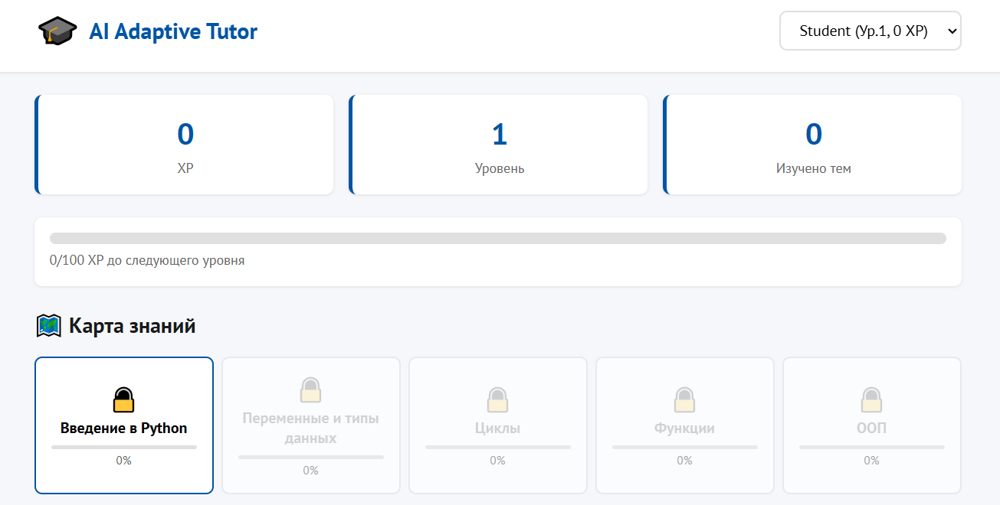
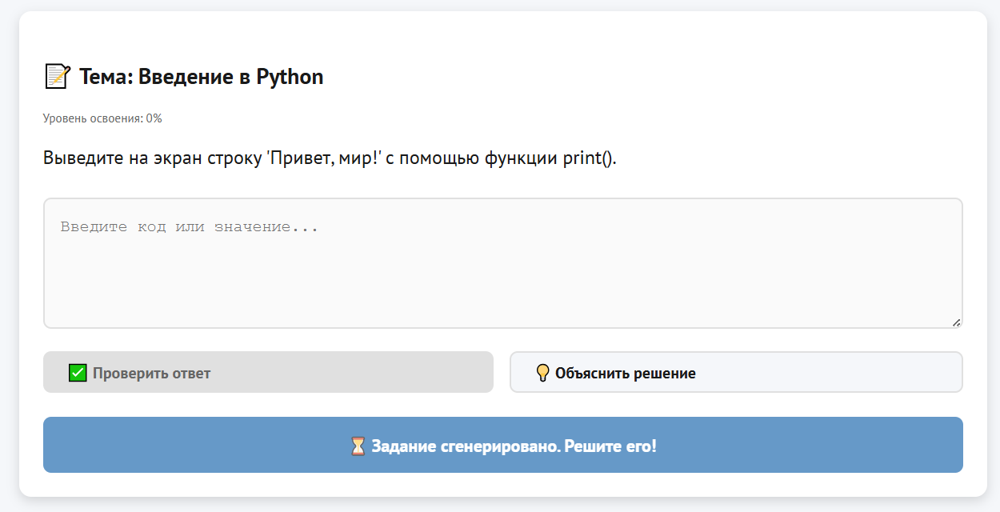
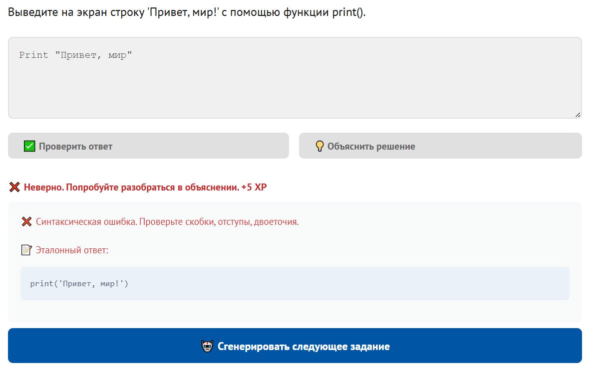

# Прототип адаптивной образовательной ИИ-системы с элементами геймификации

Программный прототип образовательной платформы, разработанной в рамках выпускной квалификационной работы. Система использует графовые модели знаний (NetworkX), генеративные языковые модели (Ollama + qwen2.5:7b) и адаптивную геймификацию для персонализации учебного процесса.

## 🎯 Ключевые возможности

- **Граф знаний с дидактическими зависимостями**: темы разблокируются только после освоения предшественников
- **Адаптивная генерация заданий**: LLM создаёт задания на основе текущего уровня мастерства и выявленных слабостей
- **Геймификация обучения**: система XP, уровней и достижений для поддержания мотивации
- **Педагогические механизмы**: асимметричное обновление мастерства, штраф за запрос готовых решений
- **Локальная LLM**: полная конфиденциальность данных (соответствие 152-ФЗ)
- **Веб-доступность**: поддержка WCAG 2.2 для инклюзивного образования

## 🛠 Стек технологий

### Backend
- **Python 3.10+**
- **FastAPI** — асинхронный веб-фреймворк с автогенерацией OpenAPI-документации
- **SQLModel** — ORM с Pydantic-валидацией
- **SQLite** — реляционная база данных
- **NetworkX** — библиотека для работы с графами
- **Ollama** — локальный сервер для LLM
- **qwen2.5:7b** — генеративная языковая модель

### Frontend
- **Vanilla JavaScript (ES6 Modules)** — нативные веб-технологии без фреймворков
- **HTML5 + CSS3** — семантическая вёрстка с поддержкой WCAG 2.2

## 📂 Структура проекта

```
adaptive-learning-system/
├── frontend/                       # Клиентская часть (SPA)
│   ├── index.html                  # Главная страница приложения
│   ├── css/
│   │   └── styles.css              # Стили интерфейса (WCAG 2.2 compliant)
│   └── js/
│       ├── api.js                  # Модуль для работы с REST API
│       ├── app.js                  # Главная логика приложения
│       ├── config.js               # Конфигурация фронтенда
│       └── ui.js                   # Управление DOM и UI-компонентами
│
├── backend/                        # Серверная часть (API)
│   ├── main.py                     # Точка входа FastAPI-приложения
│   ├── knowledge_graph.py          # Управление графом знаний (NetworkX)
│   ├── topic_syllabus.json         # Дидактический силлабус (конфигурация)
│   ├── requirements.txt            # Python-зависимости
│   ├── students.db                 # База данных SQLite
│   │
│   ├── db/                         # Модуль работы с базой данных
│   │   ├── engine.py               # Инициализация SQLAlchemy engine
│   │   ├── migrate_prerequisites.py  # Миграция графа зависимостей
│   │   └── models.py               # SQLModel-модели (Student, Topic и др.)
│   │
│   ├── llm/                        # Модуль интеграции с LLM
│   │   ├── base.py                 # Абстрактный класс LLMProvider
│   │   ├── ollama_client.py        # Клиент для Ollama-сервера
│   │   └── __init__.py
│   │
│   ├── services/                   # Бизнес-логика системы
│   │   ├── adaptation.py           # Алгоритм адаптации и обновления мастерства
│   │   ├── student_service.py      # Работа с профилем студента
│   │   ├── task_service.py         # Генерация и верификация заданий
│   │   └── __init__.py
│   │
│   └── prompts/                    # Шаблоны промптов для LLM
│       ├── task_generation.txt     # Промпт для генерации заданий
│       ├── verify_answer.txt       # Промпт для проверки ответов
│       └── detailed_explanation.txt  # Промпт для объяснения решений
│
├── screenshots/                    # Скриншоты интерфейса (для README)
│   ├── graph_view.png
│   ├── task_view.png
│   └── error_view.png
│
├── .gitignore                      # Игнорируемые файлы
└── README.md                       # Этот файл
```


## 🚀 Инструкция по установке и запуску

### Предварительные требования

- **Python 3.10+** — [скачать](https://www.python.org/downloads/)
- **Ollama** — [скачать](https://ollama.com/download)
- **Git** — для клонирования репозитория

### Шаг 1: Клонирование репозитория

```bash
git clone https://github.com/[YOUR_USERNAME]/adaptive-learning-system.git
cd adaptive-learning-system
```
### Шаг 2: Установка Ollama и загрузка модели
#### Windows/macOS: скачать с https://ollama.com/download
#### Linux:
```
curl -fsSL https://ollama.com/install.sh | sh
```
#### Загрузка модели qwen2.5:7b
```
ollama pull qwen2.5:7b
```
### Шаг 3: Настройка backend

#### Переход в папку backend
```
cd backend
```
#### Создание виртуального окружения
```
python -m venv venv
```
#### Активация виртуального окружения
#### Windows:

venv\Scripts\activate

#### macOS/Linux:

source venv/bin/activate

#### Установка зависимостей
pip install -r requirements.txt

#### Инициализация базы данных и миграция графа зависимостей
```
python -m db.migrate_prerequisites
```
### Шаг 4: Запуск backend
#### Убедитесь, что вы в папке backend и виртуальное окружение активировано
```
uvicorn main:app --reload
```
API будет доступно по адресу: http://127.0.0.1:8000

Интерактивная документация (Swagger UI): http://127.0.0.1:8000/docs

### Шаг 5: Запуск frontend

Откройте новый терминал (не закрывая backend):

cd frontend

python -m http.server 3000

### Откройте браузер и перейдите по адресу: http://localhost:3000

# Демонстрация работы

## 📸 Скриншоты интерфейса

| Карта графа знаний | Интерфейс задания | Диагностика ошибки |
|---|---|---|
|  |  |  |

*Полный набор скриншотов доступен в Приложении Б к выпускной квалификационной работе.*

# Тестирование API через Swagger UI
FastAPI автоматически генерирует интерактивную документацию. Вы можете протестировать все эндпоинты прямо из браузера:
1. Запустите backend: uvicorn main:app --reload
2. Откройте: http://127.0.0.1:8000/docs
3. Выберите эндпоинт → нажмите "Try it out" → введите параметры → "Execute"

Основные эндпоинты:

GET /student/{student_id} — получить профиль студента

GET /topics/unlocked/{student_id} — список разблокированных тем

POST /task/generate — сгенерировать задание

POST /task/submit — отправить решение

POST /task/explain — запросить объяснение

# Конфигурация
Дидактический силлабус (topic_syllabus.json)
Файл backend/topic_syllabus.json содержит конфигурацию адаптации для каждой темы:
```
{
  "topic_id": 1,
  "topic_name": "Введение в Python",
  "stages": [
    {
      "stage_name": "basic_print",
      "mastery_range": [0.0, 0.25],
      "allowed": ["print", "strings"],
      "banned": ["input", "variables", "if", "for", "while"]
    }
  ]
}
```
mastery_range — диапазон мастерства, в котором активен этот этап

allowed — разрешённые синтаксические конструкции

banned — запрещённые конструкции (LLM не будет их использовать)

### Архитектура системы
Детальная схема программной архитектуры представлена в Приложении А к ВКР.
Основные модули:
1. Knowledge Graph Manager — управление графом знаний и проверка зависимостей
2. Analyzer — анализ ответов студента, обновление мастерства, диагностика слабостей
3. Game Engine — геймификация (XP, уровни, достижения)
4. Generator — генерация персонализированных заданий через LLM

# Известные ограничения
Граф знаний охватывает только базовый курс "Основы Python" (5 тем)

Локальная LLM требует 8-12 ГБ оперативной памяти

Время генерации задания: 2-5 секунд (зависит от hardware)

Профилирование стилей обучения (learning_style) реализовано в БД, но не задействовано в генерации

# Планы развития
Расширение графа знаний (структуры данных, алгоритмы, ООП)

Семантическое кэширование для оптимизации времени отклика LLM

Интеграция статических анализаторов (pylint, flake8)

Активация адаптации под стили обучения (визуальный, аудиальный, кинестетический)

Полномасштабное A/B-тестирование на студенческой выборке


## Лицензия и использование
Данный проект разработан в рамках выпускной квалификационной работы по направлению 38.03.05 "Бизнес-информатика" в НИУ ВШЭ.
Исходный код доступен для ознакомления и использования в образовательных целях.

Разработано для улучшения цифрового образования
